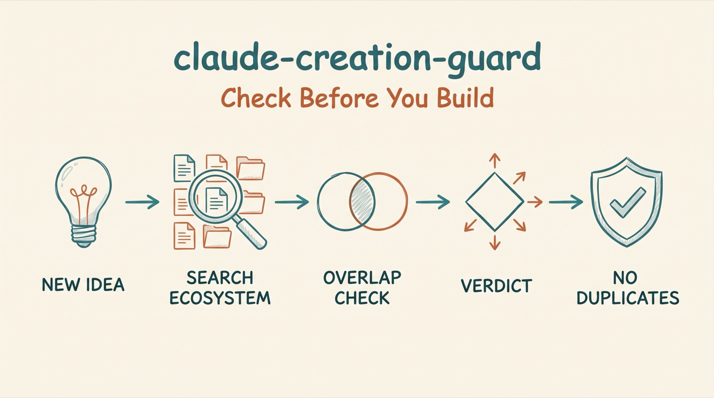

# Creation Guard

*Prevent duplicate Claude Code artifacts by analyzing your existing ecosystem before creating new ones.*




A Claude Code skill that prevents duplicate functionality by analyzing existing artifacts before creating new ones.

## Why

When working with Claude Code over time, you accumulate skills, agents, commands, and CLI tools. Without guardrails, it's easy to:

- Create a new skill that duplicates an existing one
- Build commands with overlapping functionality
- End up with multiple ways to do the same thing
- Forget what tools you already have

This skill enforces "look before you leap" — analyzing your existing artifacts before creating new ones.

## Install

```bash
# In Claude Code:
/plugin marketplace add aplaceforallmystuff/marketplace
/plugin install claude-creation-guard@aplaceforallmystuff
```

<details>
<summary>Manual install (without the marketplace)</summary>

```bash
git clone https://github.com/aplaceforallmystuff/claude-creation-guard.git ~/.claude/skills/creation-guard
```
</details>

## Use cases

- Use it when you ask Claude to "create a skill for..." a task.
- Use it when you want a new slash command or agent added.
- Use it when you're about to build a CLI tool in `~/bin/`.
- Use it when you describe automating a workflow as a new capability, even without saying "create".
- Use it when external feedback identifies a gap ("do you have a solution for X?").

## How it works

When you ask Claude to create a new skill, agent, command, or CLI tool, this skill:

1. **Searches** all existing artifacts in `~/.claude/`
2. **Analyzes** overlap with the proposed functionality
3. **Recommends** one of five actions:
   - **PROCEED** — Genuinely new, go ahead
   - **EXTEND** — Add to existing artifact instead
   - **COMPOSE** — Combine existing tools
   - **ITERATE** — Refine the proposal
   - **BLOCK** — Would create problematic duplication
4. **Waits** for explicit user approval before creating anything

| Recommendation | When Used | Action |
|----------------|-----------|--------|
| **PROCEED** | <20% overlap, genuinely new | Create the artifact |
| **EXTEND** | 50%+ overlap with one artifact | Modify existing instead |
| **COMPOSE** | Multiple artifacts cover 80%+ | Create thin wrapper or document workflow |
| **ITERATE** | 20-50% overlap | Refine proposal to differentiate |
| **BLOCK** | Would duplicate existing | Do not create |

The skill activates when Claude detects intent to create new artifacts:

- "Create a skill for..."
- "I want a new command that..."
- "Let's add an agent for..."
- "Build a CLI tool to..."

## Example

```
════════════════════════════════════════════════════════════════
CREATION GUARD ANALYSIS
════════════════════════════════════════════════════════════════

PROPOSAL:
  Type: skill
  Name: ai-detector
  Purpose: Detect AI-generated content in text

EXISTING ARTIFACTS ANALYZED: 45

RELATED ARTIFACTS FOUND:

1. slop-detector (skill)
   Purpose: Detect AI-generated writing patterns
   Overlap: 95% - Same detection framework

RECOMMENDATION: BLOCK

RATIONALE:
slop-detector already provides comprehensive AI writing detection
with tiered patterns and scoring. Creating ai-detector would
duplicate this functionality.

SUGGESTED ACTION:
Use the existing slop-detector skill, or extend it if specific
features are missing.

════════════════════════════════════════════════════════════════
Proceed with creation? (y/n/discuss)
════════════════════════════════════════════════════════════════
```

(Illustrative output.)

## Configuration

No credentials or external tools are required. For automatic enforcement, add this to your `CLAUDE.md`:

```markdown
## Artifact Creation Guard (MANDATORY)

Before creating ANY new skill, agent, command, or CLI tool, MUST invoke the `creation-guard` skill.

**Trigger phrases that require this check:**
- "Create a skill for..."
- "Let's add a command that..."
- "Build an agent for..."
- "Make a CLI tool to..."

**Process:**
1. STOP before writing any new artifact
2. Run creation-guard analysis
3. Search existing skills, agents, commands for overlap
4. Present findings with recommendation
5. Get explicit user approval
6. Only then proceed (or take alternative action)
```

## Related Skills

Part of the [aplaceforallmystuff](https://skills.sh/aplaceforallmystuff) skills collection:

- **[ecosystem-health](https://github.com/aplaceforallmystuff/claude-ecosystem-health)** — Detect drift across your entire Claude Code setup
- **[think-first](https://github.com/aplaceforallmystuff/claude-think-first)** — Mental model application before significant decisions
- **[rfu-audit](https://github.com/aplaceforallmystuff/claude-rfu-audit)** — 11-gate utility validation before investing effort

## License

MIT — see [LICENSE](LICENSE).

---

**The goal: One tool per job, clearly named, easy to find.**
